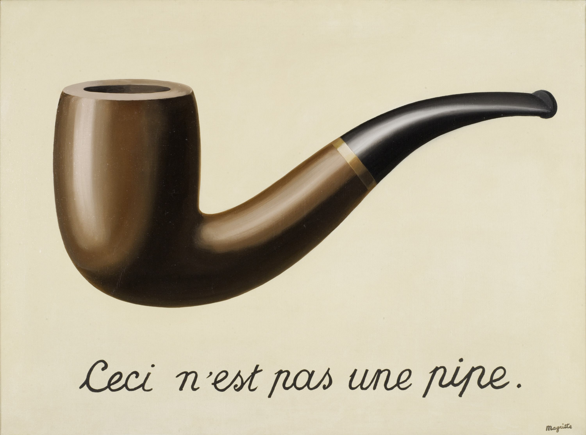

```{r setup, include=FALSE}
library(dplyr)
library(readr)
library(ggplot2)
library(tidyr)
```

##  {.center background-color="#1A0A0F"}

::: {style="text-align:left; padding-left:3rem;"}
[Aprendiendo `dplyr` paso a paso]{style="font-size:2.4rem; font-weight:700; color:#FFFFFF;"}

[De R base a tidyverse · 🍷 **Vinos** + 🏥 **Salud**]{style="font-size:1.2rem; color:#D4B0BB; display:block; margin-top:1rem;"}

[`dataset_categorical_NA.csv` · UCI ML Repository]{style="font-size:0.9rem; color:#7A5560; display:block; margin-top:2rem;"}
:::

------------------------------------------------------------------------

# ¿Por qué `dplyr`? {background-color="#1A0A0F"}

------------------------------------------------------------------------

## El problema con R base

::::: columns
::: {.column width="48%"}
**R base** — funciona, pero se lee de adentro hacia afuera:

``` r
head(
  vinos[vinos$quality >= 8,
        c("tipo", "quality", "alcohol")],
  5
)
```
:::

::: {.column width="48%"}
**dplyr** — se lee como una receta:

``` r
vinos |>
  filter(quality >= 8) |>
  select(tipo, quality, alcohol) |>
  head(5)
```
:::
:::::

. . .

> `dplyr` no reemplaza a R base — lo hace más legible.\
> El vocabulario completo son **6 verbos**.

------------------------------------------------------------------------

## Los 6 verbos

::: r-fit-text
| Verbo         | ¿Qué hace?                         |
|---------------|------------------------------------|
| `filter()`    | Filtra **filas** por condición     |
| `select()`    | Elige **columnas**                 |
| `arrange()`   | **Ordena** filas                   |
| `mutate()`    | **Crea o modifica** columnas       |
| `summarise()` | **Resume** la tabla a estadísticos |
| `group_by()`  | **Agrupa** para operar por grupo   |
:::

------------------------------------------------------------------------

# Los datos {background-color="#1A0A0F"}

------------------------------------------------------------------------

## Dataset 1 — Vinos 🍷 {.smaller}

**Fuente:** UCI Machine Learning Repository · Portugal

::::: columns
::: {.column width="40%"}
-   **6,497** muestras
-   **12** variables fisicoquímicas
-   Calidad: escala **0–10**
-   Tipos: `tinto` y `blanco`
:::

::: {.column width="58%"}
| Variable           | Descripción            |
|--------------------|------------------------|
| `tipo`             | `"tinto"` o `"blanco"` |
| `quality`          | Puntuación del catador |
| `alcohol`          | \% de alcohol          |
| `pH`               | Acidez (2.9–3.9)       |
| `volatile acidity` | Acidez volátil         |
| `residual sugar`   | Azúcar residual        |
:::
:::::

``` r
url_tinto  <- "https://archive.ics.uci.edu/ml/.../winequality-red.csv"
url_blanco <- "https://archive.ics.uci.edu/ml/.../winequality-white.csv"
vinos <- bind_rows(
  mutate(read_delim(url_tinto,  delim=";"), tipo="tinto"),
  mutate(read_delim(url_blanco, delim=";"), tipo="blanco")
)
```

------------------------------------------------------------------------

## Dataset 2 — Indicadores de salud 🏥 {.smaller}

**Fuente:** `dataset_categorical_NA.csv`

::::: columns
::: {.column width="48%"}
**Numéricas**

`Age` · `BMI` · `BloodPressure`\
`Cholesterol` · `Glucose`\
`StressLevel` · `SleepHours`

**20 participantes · 26 variables**
:::

::: {.column width="48%"}
**Categóricas**

`SmokingStatus` → Fuma / No fuma / Ex-fumadora\
`EducationLevel` → Preparatoria / Universidad / Posgrado\
`MaritalStatus` · `EmploymentStatus`\
`ResidenceType` → Urbano / Suburbano / Rural
:::
:::::

. . .

::: callout-warning
## ⚠️ Valores NA

Los datos faltantes son realidad en salud. Usa `na.rm = TRUE` en resúmenes, `is.na()` en filtros, y maneja NA **primero** en `case_when()`.
:::

``` r
salud <- read_csv("01_dataset_categorical_NA.csv", show_col_types = FALSE)
```

------------------------------------------------------------------------

## El pipe `| >` o `%>%`{background-color="#0f2035"}

Antes de los verbos, necesitamos entender el pipe.

{fig-align="center" width="60%"}

------------------------------------------------------------------------

## René Magritte, "Esto no es una pipa" (1929) — la obra maestra del surrealismo.



------------------------------------------------------------------------

## El paquete magrittr y el pipe `%>%`

El pipe fue popularizado por el paquete `magrittr` de Hadley Wickham. En R 4.1 se incorporó oficialmente como `|>`.

{fig-align="center" width="90%"})

------------------------------------------------------------------------

## ¿Qué problema resuelve?

**Sin pipe** → lees de adentro hacia afuera 😵

``` r
head(vinos[vinos$quality >= 8, c("tipo","quality","alcohol")], 5)
```

. . .

**Con pipe** → lees de arriba hacia abajo ✅

``` r
vinos |>                          # 1. empezamos con los datos
  filter(quality >= 8) |>         # 2. filtramos
  select(tipo, quality, alcohol) |> # 3. elegimos columnas
  head(5)                         # 4. primeras 5 filas
```

. . .

::: callout-tip
**Atajo:** `Ctrl+Shift+M` (Win) · `Cmd+Shift+M` (Mac)
:::

------------------------------------------------------------------------

## El pipe con ambos datasets

::::: columns
::: {.column width="48%"}
🍷 **vinos**

``` r
vinos |>
  filter(tipo == "tinto") |>
  filter(quality >= 7) |>
  select(tipo, quality, alcohol) |>
  arrange(desc(alcohol)) |>
  head(8)
```
:::

::: {.column width="48%"}
🏥 **salud**

``` r
salud |>
  filter(SmokingStatus == "Fuma") |>
  select(ID, Age, BMI,
         Cholesterol) |>
  head(8)
```
:::
:::::

------------------------------------------------------------------------

# Verbo 1: `filter()` {background-color="#7B1D3A"}

## Quedarte solo con ciertas filas

------------------------------------------------------------------------

## `filter()` — La idea

::::: columns
::: {.column width="48%"}
**R base:**

``` r
vinos[vinos$quality == 9, ]
```

**dplyr:**

``` r
filter(vinos, quality == 9)
```

> No necesitas `vinos$quality` — dplyr ya sabe a qué tabla te refieres.
:::

::: {.column width="48%"}
**AND** → coma o `&`:

``` r
filter(vinos,
       tipo == "tinto",
       quality >= 8)

filter(salud,
       SmokingStatus == "Fuma",
       BMI > 25)
```
:::
:::::

------------------------------------------------------------------------

## `filter()` — OR, `%in%`, rangos

::::: columns
::: {.column width="48%"}
**OR** → `|`:

``` r
filter(vinos,
       quality == 9 | alcohol > 14)
```

**Varios valores** → `%in%`:

``` r
filter(vinos, quality %in% c(8, 9))

filter(salud,
       ResidenceType %in%
         c("Urbano", "Suburbano"))
```
:::

::: {.column width="48%"}
**Rango** → `between()`:

``` r
filter(vinos, between(pH, 3.0, 3.1))

filter(salud, between(Age, 25, 55))
```

**Incluir NA explícitamente:**

``` r
filter(salud,
       is.na(Age) | Age < 30)
```
:::
:::::

------------------------------------------------------------------------

## `filter()` — Error frecuente y ejercicio

::: callout-caution
## ⚠️ `=` vs `==`

``` r
filter(vinos, quality = 8)    # ❌  = es asignación
filter(vinos, quality == 8)   # ✅  == es comparación
```
:::

. . .

::: callout-note
## 🏋️ Ejercicios — `filter()`

1.  ¿Cuántos vinos blancos tienen calidad ≤ 5? → `filter()` + `nrow()`
2.  Filtra vinos tintos con `alcohol > mean(vinos$alcohol)`.
3.  ¿Cuántos participantes (salud) son ex-fumadores y residen en zona urbana?
4.  Filtra `StressLevel > 80`. ¿Qué `SmokingStatus` predomina? → `count()`
:::

------------------------------------------------------------------------

# Verbo 2: `select()` {background-color="#5E3A5E"}

## Elegir columnas

------------------------------------------------------------------------

## `select()` — La idea y helpers

::::: columns
::: {.column width="48%"}
``` r
# dplyr — sin comillas, sin c()
select(vinos, tipo, quality, alcohol)

# Excluir con -
salud |>
  select(-Weight, -Height) |>
  names()

# Renombrar al seleccionar
salud |>
  select(participante = ID,
         imc = BMI,
         tabaquismo = SmokingStatus)
```
:::

::: {.column width="48%"}
**Helpers de selección:**

| Helper                | Selecciona    |
|-----------------------|---------------|
| `starts_with("x")`    | Empieza con x |
| `ends_with("x")`      | Termina con x |
| `contains("x")`       | Contiene x    |
| `where(is.numeric)`   | Numéricas     |
| `where(is.character)` | Texto         |
| `everything()`        | Todo lo demás |
:::
:::::

------------------------------------------------------------------------

## `select()` — Con los datasets

::::: columns
::: {.column width="48%"}
🍷 **vinos:**

``` r
vinos |>
  select(tipo, quality,
         starts_with("total")) |>
  head(4)

vinos |>
  select(tipo, contains("acid")) |>
  head(4)
```
:::

::: {.column width="48%"}
🏥 **salud:**

``` r
salud |>
  select(where(is.character)) |>
  head(4)

salud |>
  select(ID,
         contains("Circumference")) |>
  head(4)

salud |>
  select(where(is.numeric)) |>
  head(3)
```
:::
:::::

------------------------------------------------------------------------

# Verbo 3: `arrange()` {background-color="#1D4B6E"}

## Ordenar filas

------------------------------------------------------------------------

## `arrange()` — Orden ascendente y descendente

::::: columns
::: {.column width="48%"}
**R base:**

``` r
vinos[order(-vinos$alcohol),
  c("tipo","quality","alcohol")] |>
  head(5)
```

**dplyr:**

``` r
vinos |>
  select(tipo, quality, alcohol) |>
  arrange(desc(alcohol)) |>
  head(5)
```
:::

::: {.column width="48%"}
**Múltiples columnas:**

``` r
# Vinos: quality desc, alcohol desc
vinos |>
  arrange(desc(quality),
          desc(alcohol))

# Salud: tabaquismo A-Z, BMI desc
salud |>
  filter(!is.na(SmokingStatus)) |>
  arrange(SmokingStatus,
          desc(BMI))
```
:::
:::::

. . .

::: callout-tip
**NA en `arrange()`:** siempre van al final por defecto, en cualquier dirección.
:::

------------------------------------------------------------------------

# Verbo 4: `mutate()` {background-color="#028090"}

## Crear o modificar columnas

------------------------------------------------------------------------

## `mutate()` — `ifelse()` y `case_when()`

:::::: columns
::: {.column width="48%"}
🍷 **ifelse — clasificación binaria:**

``` r
vinos <- vinos |>
  mutate(
    calidad_alta = ifelse(
      quality >= 7, "Sí", "No"
    )
  )
```

**`case_when` — múltiples categorías:**

``` r
vinos <- vinos |>
  mutate(
    categoria = case_when(
      quality <= 4 ~ "Baja",
      quality <= 6 ~ "Media",
      quality <= 8 ~ "Alta",
      TRUE         ~ "Excepcional"
    )
  )
```
:::

:::: {.column width="48%"}
🏥 **salud — NA como primera condición:**

``` r
salud <- salud |>
  mutate(
    categoria_imc = case_when(
      is.na(BMI)  ~ "Sin dato", # ← primero
      BMI < 18.5  ~ "Bajo peso",
      BMI < 25    ~ "Normal",
      BMI < 30    ~ "Sobrepeso",
      TRUE        ~ "Obesidad"
    )
  )
```

::: callout-warning
Sin `is.na()` primero, los NA caen en `TRUE` y se clasifican incorrectamente.
:::
::::
::::::

------------------------------------------------------------------------

## `mutate()` — Más ejemplos

::::: columns
::: {.column width="48%"}
🍷 **vinos — transformaciones:**

``` r
vinos <- vinos |>
  mutate(
    alcohol_c = alcohol - mean(alcohol),
    prop_so2  = `free sulfur dioxide` /
                `total sulfur dioxide`
  )
```
:::

::: {.column width="48%"}
🏥 **salud — indicadores derivados:**

``` r
salud <- salud |>
  mutate(
    riesgo_cardio =
      round((BloodPressure +
             Cholesterol) / 2, 1),
    nivel_estres = case_when(
      is.na(StressLevel) ~ "Sin dato",
      StressLevel < 30   ~ "Bajo",
      StressLevel < 60   ~ "Moderado",
      StressLevel < 80   ~ "Alto",
      TRUE               ~ "Muy alto"
    )
  )
```
:::
:::::

------------------------------------------------------------------------

## `mutate()` — Ejercicio 🏋️

::: callout-note
## Ejercicios — `mutate()`

**1. vinos** · Crea `nivel_alcohol`: `Bajo` (\<10%) · `Medio` (10–12%) · `Alto` (\>12%)

**2. salud** · Crea `grupo_edad`: `Joven` (\<30) · `Adulto` (30–50) · `Mayor` (\>50)\
 Recuerda poner `is.na(Age) ~ "Sin dato"` como primera condición.

**3. salud** · Crea `fumador_activo = TRUE` si `SmokingStatus == "Fuma"`, `FALSE` si no.
:::

------------------------------------------------------------------------

# Verbo 5: `summarise()` {background-color="#3B6E4E"}

## Colapsar la tabla a estadísticos

------------------------------------------------------------------------

## `summarise()` — La idea

::::: columns
::: {.column width="48%"}
🍷 **vinos:**

``` r
vinos |>
  summarise(
    n              = n(),
    media_alcohol  = round(mean(alcohol), 2),
    sd_alcohol     = round(sd(alcohol), 2),
    min_calidad    = min(quality),
    max_calidad    = max(quality)
  )
```
:::

::: {.column width="48%"}
🏥 **salud — con `na.rm`:**

``` r
salud |>
  summarise(
    n            = n(),
    media_imc    = round(
      mean(BMI, na.rm = TRUE), 1),
    media_edad   = round(
      mean(Age, na.rm = TRUE), 1),
    n_sin_edad   = sum(is.na(Age))
  )
```
:::
:::::

. . .

::: callout-tip
Añade siempre `na.rm = TRUE` en funciones de resumen cuando el dataset tiene NA.
:::

------------------------------------------------------------------------

## Funciones útiles en `summarise()`

| Función                 | ¿Qué hace?              |
|-------------------------|-------------------------|
| `n()`                   | Cuenta filas            |
| `n_distinct(x)`         | Cuenta valores únicos   |
| `mean(x, na.rm=TRUE)`   | Promedio (ignorando NA) |
| `median(x, na.rm=TRUE)` | Mediana                 |
| `sd(x, na.rm=TRUE)`     | Desviación estándar     |
| `sum(x, na.rm=TRUE)`    | Suma                    |
| `min(x)` / `max(x)`     | Mínimo / Máximo         |
| `sum(is.na(x))`         | Cuenta los NA           |

------------------------------------------------------------------------

# Verbo 6: `group_by()` + `summarise()` {background-color="#C8993A"}

## La combinación más poderosa

------------------------------------------------------------------------

## `group_by()` — La idea

::::: columns
::: {.column width="48%"}
**R base:**

``` r
tapply(vinos$quality,
       vinos$tipo, mean)
```

**dplyr:**

``` r
vinos |>
  group_by(tipo) |>
  summarise(
    n             = n(),
    calidad_media = round(mean(quality), 2),
    alcohol_medio = round(mean(alcohol), 2),
    ph_medio      = round(mean(pH), 2),
    .groups       = "drop"  # ← siempre
  )
```
:::

::: {.column width="48%"}
🏥 **salud por tabaquismo:**

``` r
salud |>
  filter(!is.na(SmokingStatus)) |>
  group_by(SmokingStatus) |>
  summarise(
    n             = n(),
    media_imc     = round(
      mean(BMI, na.rm=TRUE), 1),
    media_presion = round(
      mean(BloodPressure,
           na.rm=TRUE), 1),
    .groups       = "drop"
  )
```
:::
:::::

. . .

::: callout-warning
Siempre añade `.groups = "drop"` para no dejar la tabla agrupada accidentalmente.
:::

------------------------------------------------------------------------

## `count()` — el atajo

``` r
# Estas dos instrucciones producen el mismo resultado:
vinos |>
  group_by(tipo, categoria) |>
  summarise(n = n(), .groups = "drop")

# Atajo:
vinos |> count(tipo, categoria)

# En salud:
salud |> count(EducationLevel, sort = TRUE)
```

------------------------------------------------------------------------

## `group_by()` — Ejercicio 🏋️

::: callout-note
## Ejercicios — `group_by()` + `summarise()`

**1. vinos** · Promedio de `alcohol`, `pH` y `quality` por combinación de `tipo` y `categoria`.

**2. salud** · ¿Qué `MaritalStatus` tiene el estrés más alto en promedio? Top 3.\
*Pista:* `slice_max(media_estres, n = 3)`

**3. salud** · Promedio de `Glucose` y `Cholesterol` por `SmokingStatus`.

**4. Desafío** · ¿Qué combinación `EducationLevel` + `ResidenceType` tiene el mayor BMI promedio?
:::

------------------------------------------------------------------------

# Joins {background-color="#7B1D3A"}

## Combinar dos tablas por una llave en común

------------------------------------------------------------------------

## Los joins principales

```         
Tabla A:  id1  id2  id3  id4
Tabla B:       id2  id3  id4  id5

inner_join() → {id2, id3, id4}
left_join()  → {id1, id2, id3, id4}  ← el más usado
full_join()  → {id1, id2, id3, id4, id5}
anti_join()  → {id1}  (los de A sin coincidencia en B)
```

. . .

::::: columns
::: {.column width="48%"}
``` r
inner_join(clientes, pedidos,
           by = "id")

left_join(clientes, pedidos,
          by = "id")
```
:::

::: {.column width="48%"}
``` r
full_join(clientes, pedidos,
          by = "id")

anti_join(clientes, pedidos,
          by = "id")
```
:::
:::::

------------------------------------------------------------------------

## Joins en la práctica — salud

``` r
# Tabla resumen por zona de residencia
resumen_zona <- salud |>
  group_by(ResidenceType) |>
  summarise(
    imc_promedio_zona = round(mean(BMI, na.rm = TRUE), 1),
    n_en_zona         = n(),
    .groups           = "drop"
  )

# Enriquecer cada participante con el contexto de su zona
salud |>
  select(ID, ResidenceType, BMI) |>
  left_join(resumen_zona, by = "ResidenceType") |>
  mutate(diferencia_imc = round(BMI - imc_promedio_zona, 2)) |>
  arrange(desc(diferencia_imc))
```

------------------------------------------------------------------------

# Funciones de ventana {background-color="#028090"}

## Calcular por fila usando el contexto del grupo

------------------------------------------------------------------------

## Ranking y comparación con el grupo

::::: columns
::: {.column width="48%"}
🍷 **vinos — ranking:**

``` r
vinos |>
  filter(tipo == "tinto") |>
  mutate(
    ranking = row_number(desc(quality))
  ) |>
  filter(ranking <= 5) |>
  select(tipo, quality, alcohol, ranking)
```

**Comparar con promedio del grupo:**

``` r
vinos |>
  group_by(tipo) |>
  mutate(
    prom_tipo  = mean(quality),
    diferencia = round(quality - prom_tipo, 2)
  ) |>
  ungroup()
```
:::

::: {.column width="48%"}
🏥 **salud — ranking por grupo:**

``` r
salud |>
  filter(!is.na(SmokingStatus)) |>
  group_by(SmokingStatus) |>
  mutate(
    ranking_imc = dense_rank(desc(BMI))
  ) |>
  filter(ranking_imc <= 3) |>
  select(ID, SmokingStatus,
         BMI, ranking_imc)
```

**`lag()` — diferencias entre filas:**

``` r
salud |>
  arrange(Age) |>
  mutate(
    dif_imc = round(BMI - lag(BMI), 2)
  )
```
:::
:::::

------------------------------------------------------------------------

# Verbos adicionales {background-color="#1A0A0F"}

------------------------------------------------------------------------

## `across()`, `slice_max()`, `distinct()`

::::: columns
::: {.column width="48%"}
**`across()` — muchas columnas a la vez:**

``` r
# Media de varias cols. por tipo (vinos)
vinos |>
  group_by(tipo) |>
  summarise(
    across(c(quality, alcohol, pH),
           ~ round(mean(.x), 2)),
    .groups = "drop"
  )

# Todas las numéricas (salud)
salud |>
  filter(!is.na(SmokingStatus)) |>
  group_by(SmokingStatus) |>
  summarise(
    across(where(is.numeric),
           ~ round(mean(.x, na.rm=TRUE), 1)),
    .groups = "drop"
  )
```
:::

::: {.column width="48%"}
**`slice_max()` / `distinct()`:**

``` r
# Top 3 vinos por tipo
vinos |>
  group_by(tipo) |>
  slice_max(quality, n = 3) |>
  select(tipo, quality, alcohol)

# Mayor BMI por zona (salud)
salud |>
  group_by(ResidenceType) |>
  slice_max(BMI, n = 1) |>
  select(ID, ResidenceType,
         BMI, SmokingStatus)

# Valores únicos
salud |> distinct(SmokingStatus)
vinos |> distinct(quality) |>
  arrange(quality)
```
:::
:::::

------------------------------------------------------------------------

# Caso integrador {background-color="#1A0A0F"}

## Todo junto con ambos datasets

------------------------------------------------------------------------

## Pregunta 1 — ¿El alcohol distingue los mejores vinos? 🍷

``` r
# Análisis
vinos |>
  group_by(tipo, quality) |>
  summarise(
    n             = n(),
    alcohol_medio = round(mean(alcohol), 2),
    ph_medio      = round(mean(pH), 2),
    .groups       = "drop"
  ) |>
  arrange(tipo, quality)
```

``` r
# Visualización
vinos |>
  group_by(tipo, quality) |>
  summarise(alcohol_medio = mean(alcohol), .groups = "drop") |>
  ggplot(aes(x = quality, y = alcohol_medio, color = tipo, group = tipo)) +
  geom_line(size = 1) + geom_point(size = 2) +
  scale_color_manual(values = c("tinto" = "#7B1D3A", "blanco" = "#C8993A")) +
  labs(title = "¿El alcohol distingue los vinos de alta calidad?",
       x = "Calidad", y = "Alcohol promedio (%)") +
  theme_minimal()
```

------------------------------------------------------------------------

## Pregunta 2 — IMC por tabaquismo y educación 🏥

``` r
# Análisis
salud |>
  filter(!is.na(SmokingStatus), !is.na(EducationLevel), !is.na(BMI)) |>
  group_by(SmokingStatus, EducationLevel) |>
  summarise(
    media_imc = round(mean(BMI, na.rm = TRUE), 1),
    n         = n(),
    .groups   = "drop"
  ) |>
  arrange(SmokingStatus, desc(media_imc))
```

``` r
# Visualización
salud |>
  filter(!is.na(SmokingStatus), !is.na(EducationLevel)) |>
  group_by(SmokingStatus, EducationLevel) |>
  summarise(media_imc = mean(BMI, na.rm=TRUE), .groups="drop") |>
  ggplot(aes(x = EducationLevel, y = media_imc, fill = SmokingStatus)) +
  geom_col(position = "dodge", alpha = 0.85) +
  scale_fill_manual(values = c("Fuma"="#E03131","No fuma"="#2F9E44","Ex-fumadora"="#F08C00")) +
  theme_minimal() + theme(legend.position = "bottom")
```

------------------------------------------------------------------------

## 🏆 Ejercicio integrador final

::: callout-note
## Dos preguntas, un pipeline cada una

**A) vinos** · ¿Cuál es el promedio de calidad de los vinos blancos de categoría "Alta" o "Excepcional", agrupado por `nivel_alcohol`?\
*Pista:* primero crea `nivel_alcohol` con `mutate()` + `case_when()`.

**B) salud** · ¿Qué 5 participantes tienen la mayor diferencia entre su BMI y el BMI promedio de su grupo educativo?\
Muestra: `ID`, `EducationLevel`, `BMI`, `imc_prom_educ`, `diferencia_imc`.
:::

------------------------------------------------------------------------

# Resumen {background-color="#1A0A0F"}

------------------------------------------------------------------------

## Los 6 verbos + joins

| Verbo         | ¿Qué hace?            | R base equiv.             |
|---------------|-----------------------|---------------------------|
| `filter()`    | Filtra filas          | `df[condición, ]`         |
| `select()`    | Elige columnas        | `df[, c("col")]`          |
| `arrange()`   | Ordena filas          | `df[order(...), ]`        |
| `mutate()`    | Crea / modifica cols. | `df$nueva <- ...`         |
| `summarise()` | Resume a estadísticos | `mean()`, `sum()`…        |
| `group_by()`  | Agrupa por grupo      | `tapply()`, `aggregate()` |
| `*_join()`    | Une dos tablas        | `merge()`                 |

. . .

> **El pipe `|>`** los une todos de forma legible, de arriba a abajo.

------------------------------------------------------------------------

## Próximos pasos en tidyverse

::::: columns
::: {.column width="48%"}
📦 **tidyr**\
`pivot_wider()` / `pivot_longer()`\
Transformar la forma de las tablas

📦 **stringr**\
Manipular texto y cadenas de caracteres
:::

::: {.column width="48%"}
📦 **lubridate**\
Trabajar con fechas y tiempos

📦 **ggplot2**\
Visualización de datos *(ya usada en este tutorial)*
:::
:::::

------------------------------------------------------------------------

##  {.center background-color="#1A0A0F"}

::: {style="text-align:center; padding:3rem;"}
[¡Gracias!]{style="font-size:3.5rem; font-weight:700; color:#FFFFFF;"}

[🍷 · 🏥 · 📊]{style="font-size:2.5rem; display:block; margin-top:1rem; color:#7B1D3A;"}

[`dplyr` + `tidyverse` + R]{style="font-size:1.2rem; color:#7A5560; display:block; margin-top:2rem; font-family:monospace;"}
:::
